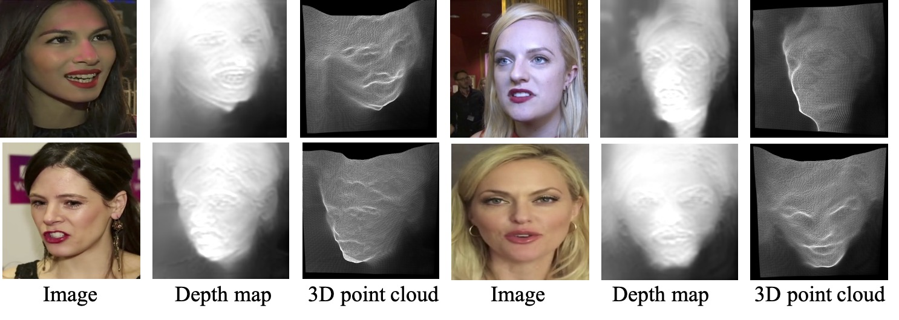

## :book: The Face Depth Network of ``Depth-Aware Generative Adversarial Network for Talking Head Video Generation'' (CVPR 2022)
<p align="center">
  <small>:fire: If DaGAN is helpful in your photos/projects, please help to :star: it or recommend it to your friends. Thanks:fire:</small>
</p>

> [[Paper](https://arxiv.org/abs/2203.06605)] &emsp; [[Project Page](https://harlanhong.github.io/publications/dagan.html)] &emsp; [[Demo](https://huggingface.co/spaces/HarlanHong/DaGAN)] &emsp; [[Poster Video](https://www.youtube.com/watch?v=nahsJNjWzGo&t=1s)]<br>
<!-- > [Fa-Ting Hong](https://harlanhong.github.io), [Longhao Zhang](https://dblp.org/pid/236/7382.html), [Li Shen](https://scholar.google.co.uk/citations?user=ABbCaxsAAAAJ&hl=en), [Dan Xu](https://www.danxurgb.net) <br> -->
<!-- > The Hong Kong University of Science and Technology, Alibaba Cloud -->
> [Fa-Ting Hong](https://harlanhong.github.io), [Longhao Zhang](), [Li Shen](), [Dan Xu](https://www.danxurgb.net) <br>
> The Hong Kong University of Science and Technology
### Cartoon Sample
https://user-images.githubusercontent.com/19970321/162151632-0195292f-30b8-4122-8afd-9b1698f1e4fe.mp4

### Human Sample
https://user-images.githubusercontent.com/19970321/162151327-f2930231-42e3-40f2-bfca-a88529599f0f.mp4

### Image Dataset
<p align="center">
  
</p>


## :wrench: Dependencies and Installation

- Python >= 3.7 (Recommend to use [Anaconda](https://www.anaconda.com/download/#linux) or [Miniconda](https://docs.conda.io/en/latest/miniconda.html))
- [PyTorch >= 1.7](https://pytorch.org/)
- Option: NVIDIA GPU + [CUDA](https://developer.nvidia.com/cuda-downloads)
- Option: Linux

### ⚙️ Setup

1. Clone repo

    ```bash
    git clone https://github.com/harlanhong/DaGAN-Head.git
    cd CVPR2022-Head
    ```

2. Install dependent packages

    ```bash
    conda install pytorch=0.4.1 torchvision=0.2.1 -c pytorch
    pip install tensorboardX==1.4
    conda install opencv=3.3.1   # just needed for evaluation
    ```
    Or you can use the environment of [DaGAN](https://github.com/harlanhong/CVPR2022-DaGAN) directly
## :zap: Quick Inference

### Pre-trained checkpoint
The pre-trained checkpoint of face depth network and our DaGAN checkpoints can be found under following link: [OneDrive](https://hkustconnect-my.sharepoint.com/:f:/g/personal/fhongac_connect_ust_hk/EjfeXuzwo3JMn7s0oOPN_q0B81P5Wgu_kbYJAh7uSAKS2w?e=KaQcPk).

**Inference!**
To run a demo, download checkpoint and run the following command to predict scaled disparity for a single image with:


```shell
python test_simple.py --image_path assets/test_image.jpg --model_name tmp/You_Model/models/weights_19
```

## :computer: Training


### Datasets
 
1) **VoxCeleb**. Please follow the instruction from https://github.com/AliaksandrSiarohin/video-preprocessing.

### Train on VoxCeleb
To train a model on specific dataset run:
```
CUDA_VISIBLE_DEVICES=0 python train.py --batch_size 2  --heigh 256 --width 256 --dataset vox  --sample_num 100000 --model_name taking_head_10w --data_path vox2

```


### Training on your own dataset
You can train on a custom monocular or stereo dataset by writing a new dataloader class which inherits from `MonoDataset` – see the `CELEBDataset` class in `datasets/celeb_dataset.py` for an example.


## ⏳ Training

By default models and tensorboard event files are saved to `~/tmp/<model_name>`.
This can be changed with the `--log_dir` flag.

**Monocular training:**
```shell
CUDA_VISIBLE_DEVICES=1 python train.py --model_name mono_model_in --png --batch_size 12
```


## :scroll: Acknowledgement

 Our Face-Depth-Network implementation is borrowed from [Monodepth2](https://github.com/nianticlabs/monodepth2). We appreciate the authors of Monodepth2 for making their codes available to public.

## :scroll: BibTeX

```
@inproceedings{hong2022depth,
            title={Depth-Aware Generative Adversarial Network for Talking Head Video Generation},
            author={Hong, Fa-Ting and Zhang, Longhao and Shen, Li and Xu, Dan},
            journal={IEEE/CVF Conference on Computer Vision and Pattern Recognition (CVPR)},
            year={2022}
          }
```

### :e-mail: Contact

If you have any question, please email `fhongac@cse.ust.hk`.